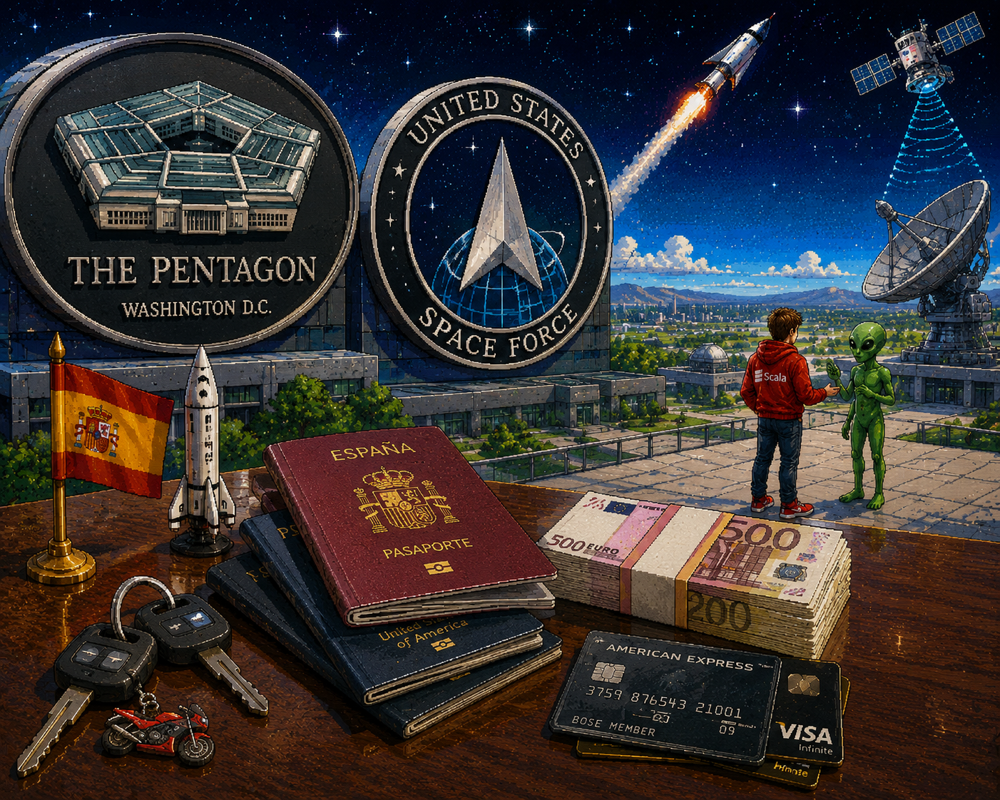
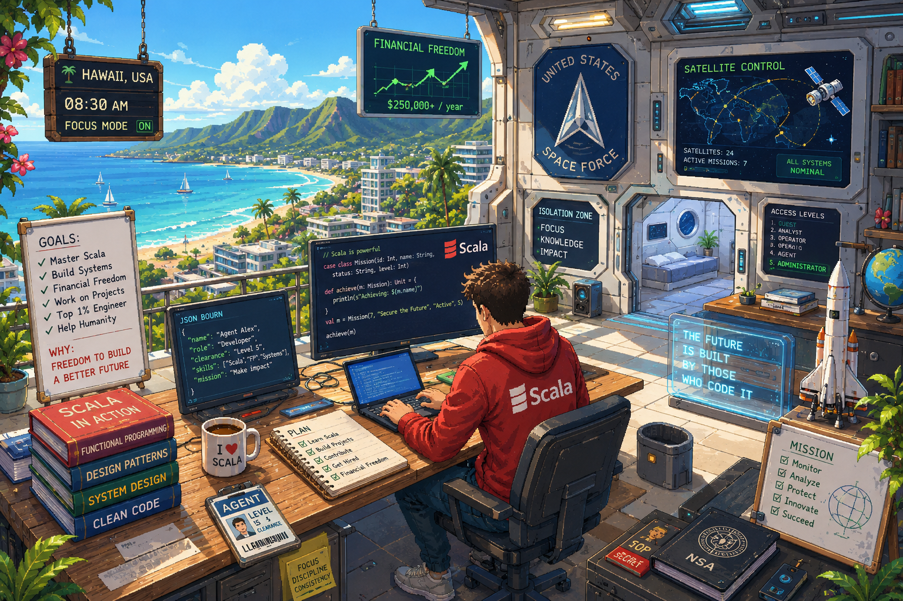
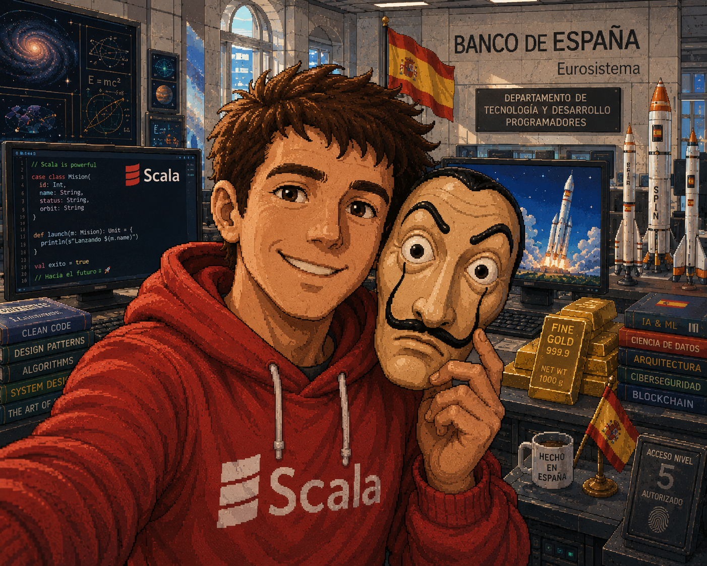
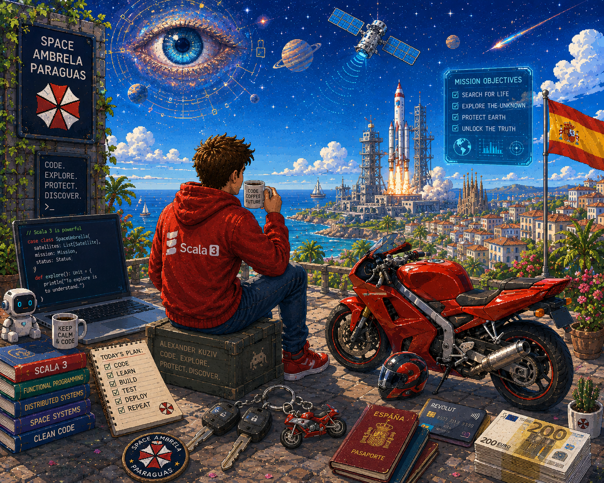

# Project <span style="color:#869e37;">Space Umbrella</span> 🛸 - Scala 3

This project acts as a showcase of modern **Scala 3** development practices, leveraging **Http4s**, **Cats**, and **Doobie** 
to build a deterministic orbital asset management system. Designed to simulate the core inventory requirements of the 
US Space Force, the application provides secure CRUD operations, categorization, and telemetry logging for Earth-defense 
satellites and deep-space anomaly tracking.

<p align="left">
    
    
</p>

This project features **Hexagonal Architecture**, which is highly popular in Spanish development projects.
I think it's very important to have the opportunity to avoid being double standards and fast-paced technologies.
Hexagonal Architecture allows you to keep the system's core intact for a long time.

```text
 ┌────────────────────────────────────────────────────────────────────────┐
 │                    INFRASTRUCTURE LAYER (ADAPTERS)                     │
 │  ┌──────────────────────────────────────────────────────────────────┐  │
 │  │                   APPLICATION LAYER (USE CASES)                  │  │
 │  │  ┌────────────────────────────────────────────────────────────┐  │  │
 │  │  │                     DOMAIN LAYER (CORE)                    │  │  │
 │  │  │  ┌──────────────────────────────────────────────────────┐  │  │  │
 │  │  │  │                    AGGREGATE ROOT                    │  │  │  │
 │  │  │  │                                                      │  │  │  │
 │  │  │  │    [Main Entity]  <───────>  [Value Objects]         │  │  │  │
 │  │  │  │          │                                           │  │  │  │
 │  │  │  │          ▼ (Enforces Business Invariants)            │  │  │  │
 │  │  │  │    [Domain Rules & Logic]                            │  │  │  │
 │  │  │  └──────────────────────────────────────────────────────┘  │  │  │
 │  │  │                                                            │  │  │
 │  │  │  [In Port] (Interface)                                     │  │  │
 │  │  │  Defines what the application can do                       │  │  │
 │  │  │                                                            │  │  │
 │  │  │  [Use Case Execution]                                      │  │  │
 │  │  │  Orchestrates domain entities and business flows           │  │  │
 │  │  │                                                            │  │  │
 │  │  │  [Out Port] (Interface)                                    │  │  │
 │  │  │  Defines what the application needs from outside ──────┐   │  │  │
 │  │  └────────────────────────────────────────────────────────┼───┘  │  │
 │  │                                                           │      │  │
 │  │   [Inbound Adapter]                                       ▼      │  │
─┼──┼─> Drives the application (API/CLI/Cron)     [Out Adapter]─────────>[External Services]
 │  │                                        Driven by application  (Database/Message Broker)
 │  └──────────────────────────────────────────────────────────────────┘  │
 └────────────────────────────────────────────────────────────────────────┘
```

---
## 💻🛰️ Tech Stack & Core Concepts

*   **Backend:** **Scala 3** — Leveraging modern ecosystem features (Context Functions, Enums, and Type System) to establish an explicit separation from legacy Java practices.
*   **Frontend UI:** **React / Angular** — An interactive satellite command dashboard storing localized military and deep-space static assets.  
*   **Framework:** **Http4s** — Delivering type-safe, functional, and synchronous HTTP routes for REST API design and external integrations.
*   **Functional Core:** **Cats / Cats Core** — Managing clean computations, state validations (e.g., orbital coordinates verification), and functional abstractions.
*   **Database:** **PostgreSQL** — A robust, enterprise-grade relational database for reliable relational data storage, keeping precise historical tracking of satellite positions and secure military catalogs.  
*   **Database Access:** **Doobie** — A pure functional JDBC layer for type-safe SQL operations without internal multi-threading side effects.

---

<p align="left">
    
    
</p>

To achieve a grand result, you need to study every day. You need to have control and think clearly and fast. 
The conditions of our life, like the conditions of a programming language, have different visible and invisible 
connections.

New contacts are like new knowledge. Stars are the ultimate source of knowledge in the dark, serving as distant guides 
for both spacecraft and human desires. 

<p align="left">
    
        
</p>

Only when you have power can you fly 🛰️

Поехали! 🙂 Let's go! 

